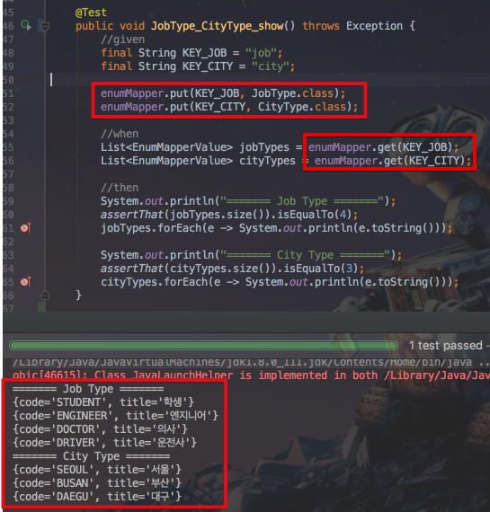
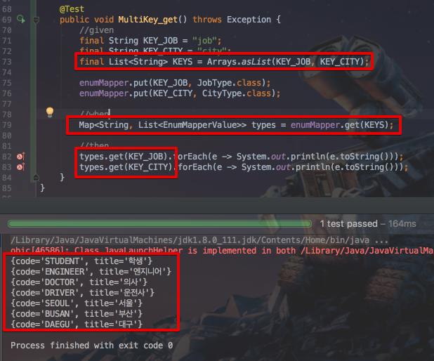
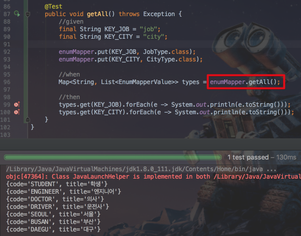

# EnumMapper

웹 프로젝트를 진행하다보면, **Enum의 데이터를 U영역에서 사용**해야할 경우가 많습니다.  
예를 들어 회원가입에 사용되는 직업의 종류를 select box로 출력시켜야 한다거나, 자신의 취미를 체크할 수 있는 radio box를 출력시켜야 하는 등등의 경우입니다.  
물론 JSP 혹은 JS에서 하드코딩 할 수 있겠지만, 백엔드와 프론트엔드가 다루는 데이터 형태가 다른것은 권장하지 않기 때문에 이를 일치시킬 필요가 있습니다.  

## 설정

### 1. EnumMapperType 구현

사용하길 원하는 enum에 ```EnumMapperType```을 구현 (implements)시킵니다.  
그리고 override가 필요한 ```getCode```와 ```getTitle```가 원하는 값을 리턴하도록 작성합니다.  
예) 

```
public enum JobType implements EnumMapperType {
    STUDENT("학생"),
    ENGINEER("엔지니어"),
    DOCTOR("의사"),
    DRIVER("운전사");

    private String title;

    JobType(String title) {
        this.title = title;
    }

    @Override
    public String getCode() {
        return name();
    }

    @Override
    public String getTitle() {
        return title;
    }
}
```

> 여기서는 enum의 name을 code값으로, title 멤버변수를 title로 지정하였습니다.  

### 2. EnumMapper에 등록

EnumMapper에 implements된 enum들을 ```put``` 한뒤  ```Bean```으로 등록합니다.

```
@Bean
public EnumMapper enumMapper() {
    EnumMapper enumMapper = new EnumMapper();

    enumMapper.put("JobType", JobType.class);
    enumMapper.put("CityType", CityType.class);
    enumMapper.put("HobbyType", HobbyType.class);

    return enumMapper;
}
```

이제 설정이 끝났습니다.  
원하는 ```@Controller```, ```@Service```에서 enumMapper를 ```@Autowired```하여 원하는 enum 타입을 가져오거나 결과로 반환하면 됩니다.

## Methods

* ```List<EnumMapperValue> get(String key)```

하나의 enum 타입 리스트를 반환합니다.



* ```Map<String, List<EnumMapperValue>> get(List<String> keys) ``` 

List에 있는 문자열에 해당하는 enum 타입들을 반환합니다.



* ```Map<String, List<EnumMapperValue>> getAll()```

EnumMapper에 등록된 모든 enum 타입들을 반환합니다.




